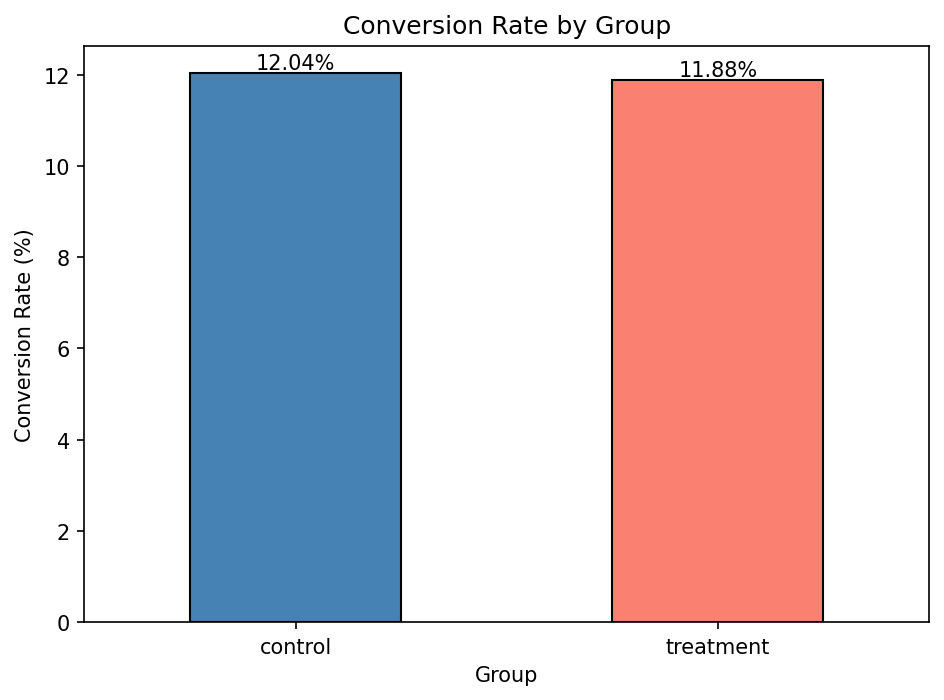
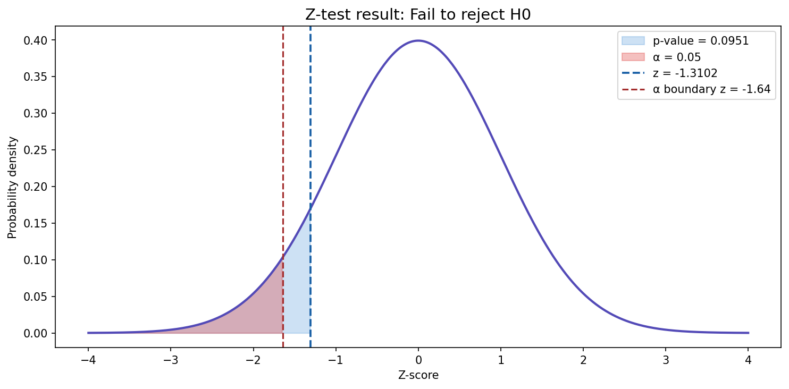

# E-commerce A/B Testing
A end-to-end A/B testing project analysing whether a new e-commerce landing page 
drives a statistically significant lift in conversion rate.

Dataset: [Kaggle - E-commerce A/B Testing](https://www.kaggle.com/datasets/ahmedmohameddawoud/ecommerce-ab-testing)

---

## Objective
Test whether a redesigned landing page improves conversion rate over the existing page
using rigorous statistical methods.

**H0:** The new page does not improve conversion rate (p_treatment <= p_control)  
**H1:** The new page improves conversion rate (p_treatment > p_control)

---

## Dataset
- 294,478 user sessions
- Columns: user ID, group (control/treatment), page seen, conversion (0/1)
- After cleaning: 290,583 rows (removed mismatched group/page assignments and duplicates)

---

## Methods
- **Exploratory Data Analysis** — data quality checks, conversion rates by group
- **Z-test for proportions** — one-tailed hypothesis test at α = 0.05
- **Power analysis** — minimum detectable effect, required sample size, actual power
- **Logistic regression** — confirms z-test result, odds ratio, confidence interval
- **Practical significance** — revenue impact of observed and hypothetical lift scenarios

---

## Key Findings

| Metric | Value |
|---|---|
| Control conversion rate | 12.04% |
| Treatment conversion rate | 11.88% |
| Observed difference | -0.16pp |
| Z-score | -1.31 |
| P-value (one-tailed) | 0.0951 |
| Odds ratio | 0.9851 |
| Test power | 100% |

- The new page does not significantly improve conversion rate (p = 0.0951 > 0.05)
- The test was well-powered — with ~145k users per group, a real 1pp lift would have 
  been detected with near certainty
- Observed difference implies a potential revenue loss of $23,200/month — however this 
  is not statistically significant and likely noise
- Had the new page achieved a 1pp lift, it would have generated an additional 
  $1,740,000/year




**Recommendation:** Do not ship the new page. Redesign and retest.

---

## Project Structure
```
ab_testing/
├── data/
│   ├── raw/          # original dataset (not tracked)
│   └── processed/    # cleaned data (not tracked)
├── notebooks/
│   └── 01_eda.ipynb  # full analysis
├── src/
│   ├── __init__.py
│   ├── ztest.py      # z-test for proportions
│   ├── power.py      # power analysis and sample size calculation
│   └── logistic.py   # logistic regression and odds ratio
├── tests/
├── .gitignore
├── poetry.lock
├── pyproject.toml
└── README.md
```

---

## Reusable Modules

The `src/` directory contains modular, importable functions for each statistical method:

```python
from src.ztest import run_ztest
from src.power import run_power_analysis
from src.logistic import run_logistic_regression

ztest_results = run_ztest(df, 'con_treat', 'treatment', 'control', 'converted')
power_results = run_power_analysis(p_baseline=0.1204, mde=0.01, n_actual=145274)
logistic_results = run_logistic_regression(df, 'is_treatment', 'converted')
```

---

## Setup

Requires Python >= 3.11 and [Poetry](https://python-poetry.org/).

```bash
poetry install
poetry run jupyter notebook
```
